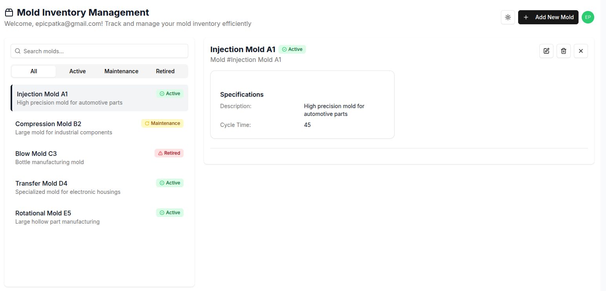

# Mold Inventory App

[https://mold-inventory-app-production.epicpatka.workers.dev/](https://mold-inventory-app-production.epicpatka.workers.dev/)

## Tech Stack
- [Auth0](https://auth0.com/)
- [Cloudflare D1](https://developers.cloudflare.com/d1/)
- [Cloudflare Workers](https://developers.cloudflare.com/workers/)
  - [Hono](https://hono.dev/)
  - [Prisma](https://www.prisma.io/)
- [Next.js](https://developers.cloudflare.com/workers/framework-guides/web-apps/nextjs/)

### Implementation Details

A custom [Cloudflare Worker](https://developers.cloudflare.com/workers/) using
  - [Auth0](https://auth0.com/) for login
  - [Hono](https://hono.dev/) for the backend web framework
  - [Prisma](https://www.prisma.io/) ORM to manage a [Cloudflare D1](https://developers.cloudflare.com/d1/) database
  - [Next.js](https://developers.cloudflare.com/workers/framework-guides/web-apps/nextjs/) as the frontend React Framework
  
The [Cloudflare Worker](https://developers.cloudflare.com/workers/) has CRUD API to manage molds and validates access token from Auth0 on each request.

UI generated with [v0.dev](https://v0.dev/).


## UI




## Setup

```bash
# install Node.js dependencies
npm install
```

### Auth0 Tenant

Copy auth0 config from `auth0-config.json.example` to `auth0-config.json` and fill out details using Machine to Machine client.

Deploy Auth0 configuration.
```bash
npm run auth0-import
```

### App

Copy `.env.example` to `.env`. Fill out Auth0 details.
```
NEXT_PUBLIC_AUTH0_DOMAIN=dev-5gm1mr1z8nbmuhv7.us.auth0.com
NEXT_PUBLIC_AUTH0_CLIENT_ID=DYZT9rpjL5LoJNfpjo8JEQtPaLqyABHO
NEXT_PUBLIC_AUTH0_AUDIENCE=mold-inventory-app-production.epicpatka.workers.dev/api
NEXT_PUBLIC_AUTH0_SCOPES="openid profile read:current_user create:molds read:molds update:molds delete:molds"
```

Configure environments in `wrangler.jsonc`.

Run locally.
```bash
# setup local Cloudflare D1 database
npm run db:migrate:local
npm run db:seed:local

# run Cloudflare Worker locally
npm run preview
```

Open [http://localhost:3000](http://localhost:3000) in your browser.


## Deploy to Cloudflare
```bash
npm run deploy
```

### Cloudflare commands
- `npm run db:create` - create mold-inventory-app database in Cloudflare
- `npm run db:migrate` - setup mold-inventory-app database in Cloudflare
- `npm run db:migrate:local` - setup mold-inventory-app database locally
- `npm run db:seed` - seed initial mold-inventory-app data in Cloudflare
- `npm run db:seed:local` - seed initial mold-inventory-app data locally
- `npm run prisma:generate` - regenerate prisma database schema
- `npm run cf-typegen` - update type definitions after adding new bindings to your Wrangler configuration
- `npm run upload` - deploy preview version to Cloudflare
- `npm run deploy` - deploy production version to Cloudflare


## Unit Testing
- `npm run test` - vitest single run
- `npm run test:watch` - vitest watch test suites for changes


# Next.js README

This is a [Next.js](https://nextjs.org) project bootstrapped with [`create-next-app`](https://nextjs.org/docs/app/api-reference/cli/create-next-app).

## Getting Started

First, run the development server:

```bash
npm run dev
# or
yarn dev
# or
pnpm dev
# or
bun dev
```

Open [http://localhost:3000](http://localhost:3000) with your browser to see the result.

You can start editing the page by modifying `app/page.tsx`. The page auto-updates as you edit the file.

This project uses [`next/font`](https://nextjs.org/docs/app/building-your-application/optimizing/fonts) to automatically optimize and load [Geist](https://vercel.com/font), a new font family for Vercel.

## Learn More

To learn more about Next.js, take a look at the following resources:

- [Next.js Documentation](https://nextjs.org/docs) - learn about Next.js features and API.
- [Learn Next.js](https://nextjs.org/learn) - an interactive Next.js tutorial.

You can check out [the Next.js GitHub repository](https://github.com/vercel/next.js) - your feedback and contributions are welcome!

## Deploy on Vercel

The easiest way to deploy your Next.js app is to use the [Vercel Platform](https://vercel.com/new?utm_medium=default-template&filter=next.js&utm_source=create-next-app&utm_campaign=create-next-app-readme) from the creators of Next.js.

Check out our [Next.js deployment documentation](https://nextjs.org/docs/app/building-your-application/deploying) for more details.
